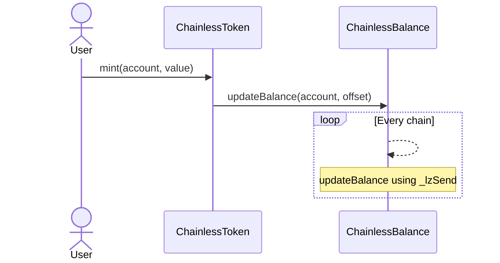
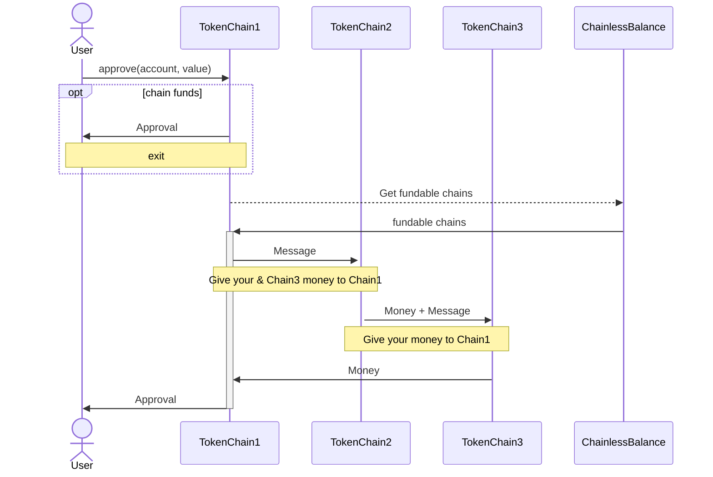

# ERC20 Unchained

Unchaining ERC-20 tokens to enable use across all chains with standard function calls, regardless of where they currently reside. Behind the scenes, LayerZero's OFT handles the balance and movement, transferring tokens wherever needed without any extra steps for the user.

## Try it out!

Demo script to mint tokens and check balance on other chains.
add PRIVATE_KEY to .env and run 
`make demo-mint-zircuit:`
you can check transaction on layer zero explorer

## Example:
[mint call](https://testnet.layerzeroscan.com/tx/0x6f8e006eb675a5a0e326f5e81223f8a9f222cc91ab91d6a5dabdcf9a907365bf)

[approve call](https://testnet.layerzeroscan.com/tx/0x68be2c51b8749de466f7ee050a3862b0ddb9e4b15229b4ca4f336efe908712b7)

for the approve call make sure to click on the destination transaction hash 2 times to see all of the 3 transactions which initiated form the one linked above called approve call,
these are the 3 transactions you will see:

- send message to other chain to get funds [tx](https://testnet.layerzeroscan.com/tx/0x68be2c51b8749de466f7ee050a3862b0ddb9e4b15229b4ca4f336efe908712b7)
- send tokens back to source chain [tx](https://testnet.layerzeroscan.com/tx/0x3bb01049021a596d3daff2f15cc1e855c77f6c08ef4bb322cdfaffcdfc92c080)
- call approve with tokens now on source chain [tx](https://testnet.layerzeroscan.com/tx/0xb70dc3aaedc8294e4af507716ef4fad1fcd741b9afd178b31b5ebda684157299)

## Description

The utility of ERC-20 tokens is increasingly limited by fragmentation across diverse networks. As assets become dispersed among these networks, the need for continual bridging introduces friction, creating barriers to seamless access and usability.
It's should be clear to all of us that we can’t onboard the next billion users like this.

This project is unchaining ERC20 tokens, allowing them to be used across all chains.
For users, the process is invisible. Everything happens behind the scenes with the standard ERC20 function calls.

## Technical

The unchained token is an [Omnichain Fungible Token (OFT)](https://docs.layerzero.network/v2/home/token-standards/oft-standard), which has an additional "ChainlessBalance" [Omnichain Applications (OApp)](https://docs.layerzero.network/v2/home/token-standards/oapp-standard) contract, to keep track of all the balances on the different chains.
Whenever the balance gets updated on one chain, all the other contracts are notified of that change immediatly through the ChainlessBalance OApp. 
If approve gets called with a value higher than the availbale amount on that chain, a message gets composed which will circle around other chains to collect the necessary funds. Once it reaches back the source chain the requested amount will be approved.

The cost for all the messages are paid by the Unchained ERC-20 contract. A fee could be taken on any transfer to cover for that cost, however this hasn't been implemented for the scope of this hackathon.

## balance change

### approval

## Future ideas

To improve transaction speed the balance could go into the negative, if it is known that enough funds will be available on another chain.
For example if total balance is 400, all 4 chains could spend 100 tokens instantly even if they go into the negative.

## dev

### latest deployments on 2 chains because scroll and unichain are buggy

- balance: 0xd2dA8680FfDbe5136EbBb26928dF635D9cB79a0F
- token: 0x753da027758f33f9dF35b8529Fa9b2e78664DfE5

### chainlessbalance
- unichain: [0x7570adcf326406ef55C03e81d568EE1836E9A0e2](https://unichain-sepolia.blockscout.com/address/0x7570adcf326406ef55C03e81d568EE1836E9A0e2)

- scroll: [0x114F9aFB1dce419E06d6709CfA87954378cf492e](https://scroll-sepolia.blockscout.com/address/0x114F9aFB1dce419E06d6709CfA87954378cf492e)
- polygon: [0x114F9aFB1dce419E06d6709CfA87954378cf492e](https://amoy.polygonscan.com/address/0x114F9aFB1dce419E06d6709CfA87954378cf492e)
- zircuit: [0x114F9aFB1dce419E06d6709CfA87954378cf492e](https://explorer.testnet.zircuit.com/address/0x114F9aFB1dce419E06d6709CfA87954378cf492e)

### chainlessToken
- unichain: [0xaC45aaab89741702a9A0083E28fbcfe28ffE7a96](https://unichain-sepolia.blockscout.com/address/0xaC45aaab89741702a9A0083E28fbcfe28ffE7a96)

- scroll: [0xA8FF03a3aF16A07e505Fa7b5c1e3E2726D9787A3](https://scroll-sepolia.blockscout.com/address/0xA8FF03a3aF16A07e505Fa7b5c1e3E2726D9787A3)
- polygon: [0xA8FF03a3aF16A07e505Fa7b5c1e3E2726D9787A3](https://amoy.polygonscan.com/address/0xA8FF03a3aF16A07e505Fa7b5c1e3E2726D9787A3)
- zircuit: [0xA8FF03a3aF16A07e505Fa7b5c1e3E2726D9787A3](https://explorer.testnet.zircuit.com/address/0xA8FF03a3aF16A07e505Fa7b5c1e3E2726D9787A3)
