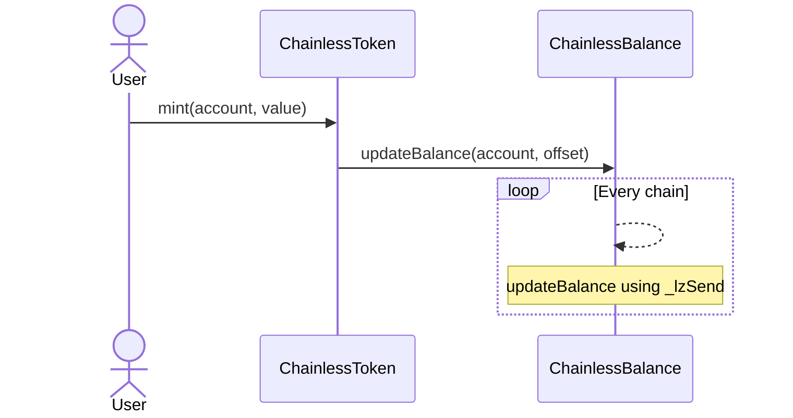
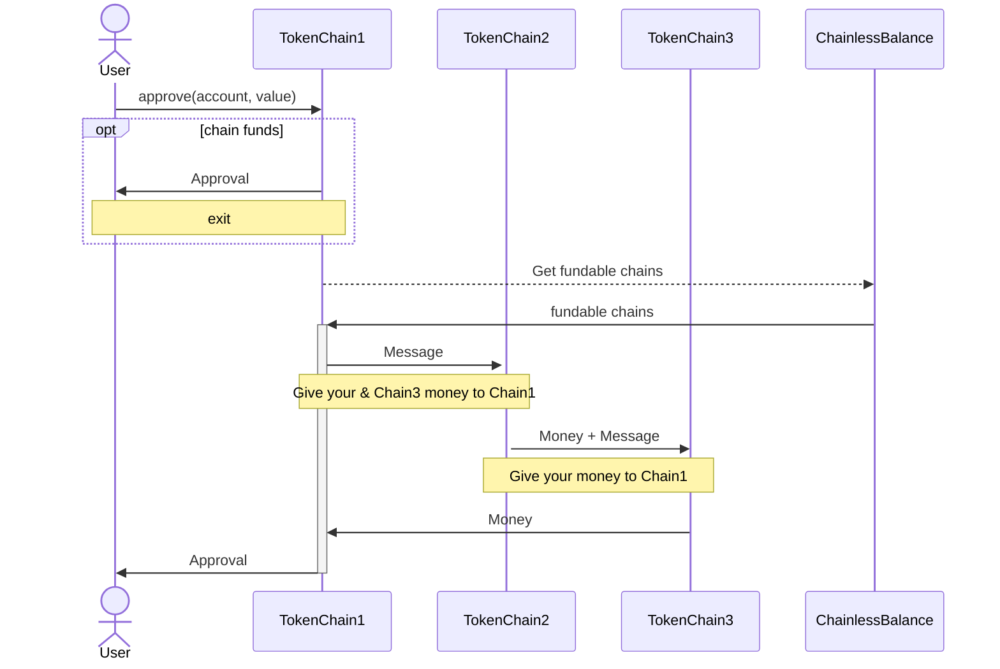

# ERC20 Unchained

Unchaining ERC-20 tokens to enable use across all chains with standard function calls, regardless of where they currently reside. Behind the scenes, LayerZero's OFT handles the balance and movement, transferring tokens wherever needed without any extra steps for the user.

## Try it out!

1. Mint some tokens
    - [base]()
    - [sepolia]()
    - [scroll](https://scroll-sepolia.blockscout.com/)
2. Use them on unichain
    - [uniswap]()

## Description

The utility of ERC-20 tokens is increasingly limited by fragmentation across diverse networks. As assets become dispersed among these networks, the need for continual bridging introduces friction, creating barriers to seamless access and usability.
It's should be clear to all of us that we can’t onboard the next billion users like this.

This project is unchaining ERC20 tokens, allowing them to be used across all chains.
For users, the process is invisible. Everything happens behind the scenes with the standard ERC20 function calls.

## Technical

The unchained token is an [Omnichain Fungible Token (OFT)](https://docs.layerzero.network/v2/home/token-standards/oft-standard), which has an additional "ChainlessBalance" [Omnichain Applications (OApp)](https://docs.layerzero.network/v2/home/token-standards/oapp-standard) contract, to keep track of all the balances on the different chains.
Whenever the balance gets updated on one chain, all the other contracts are notified of that change immediatly through the ChainlessBalance OApp. 
If approve gets called with a value higher than the availbale amount on that chain, a message gets composed which will circle around other chains to collect the necessary funds. Once it reaches back the source chain the requested amount will be approved.

The cost for all the messages are paid by the Unchained ERC-20 contract. A fee could be taken on any transfer to cover for that cost, however this hasn't been implemented for the scope of this hackathon.

## balance change

### approval

## Future ideas

To improve transaction speed the balance could go into the negative, if it is known that enough funds will be available on another chain.
For example if total balance is 400, all 4 chains could spend 100 tokens instantly even if they go into the negative.
